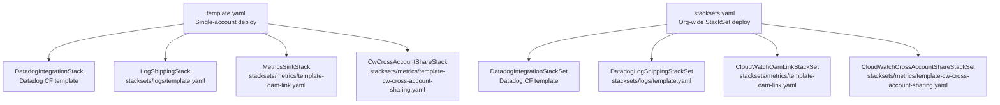
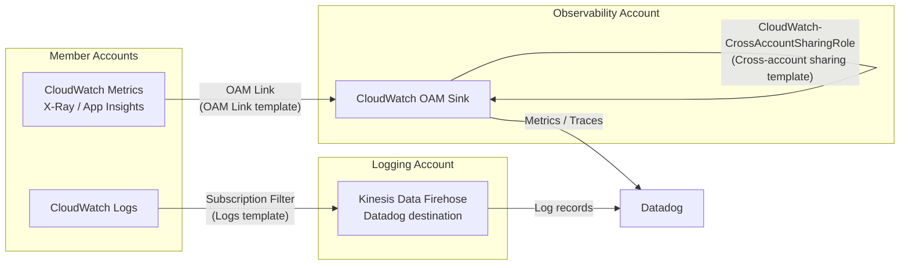

# aws-datadog-integration

Deploys the Datadog AWS integration and CloudWatch observability configuration across an AWS organization. Covers log shipping, metrics collection, and cross-account CloudWatch access for a central observability account.

## CloudFormation Stack Parameters

| Parameter | Description |
|---|---|
| `TargetOUs` | Comma-delimited list of Organization OU IDs targeted by StackSets |
| `TargetRegions` | Comma-delimited list of regions targeted by StackSets |
| `DatadogTemplateUrl` | URL to the Datadog CloudFormation template in S3 |
| `DatadogSite` | Datadog site (e.g. `us5.datadoghq.com`) |
| `DatadogApiKey` | Datadog API key |
| `DatadogAppKey` | Datadog App key |
| `DataDogLogsDestinationArn` | ARN of the Kinesis Firehose destination for log shipping |
| `AwsOamSinkArn` | ARN of the CloudWatch OAM Sink in the observability account |
| `DisableMetricCollection` | Passed to the Datadog integration template |
| `CrossAccountSharingPolicy` | Access level for cross-account CloudWatch role |
| `UseMetricsStreaming` | Whether to deploy OAM link and cross-account sharing stacks |
| `UseLogsStreaming` | Whether to deploy logs shipping stack |


## Infrastructure

### Datadog Integration (`DatadogIntegrationStack` / `DatadogIntegrationStackSet`)

Deploys the Datadog CloudFormation template that creates the IAM roles and policies required for Datadog to collect metrics and events from AWS.

- `stacksets.yaml`: uses the `DatadogTemplateUrl` parameter.
- `template.yaml` (management account): currently hardcodes URL due to an AWS SAM packaging limitation noted in the template.

### Log Shipping (`LogShippingStack` / `DatadogLogShippingStackSet`)

Configures CloudWatch Logs account-level subscription filters to forward all log groups to Datadog via a Kinesis Data Firehose destination. Uses an IAM role to allow the CloudWatch Logs service to write records to the Firehose stream.

- Controlled by `UseLogsStreaming` parameter.
- Only applied to accounts that are **not** the logging/destination account itself.
- Source template: `stacksets/logs/template.yaml`

### CloudWatch OAM Link (`MetricsSinkStack` / `CloudWatchOamLinkStackSet`)

Creates an [AWS CloudWatch Observability Access Manager (OAM)](https://docs.aws.amazon.com/OAM/latest/APIReference/Welcome.html) link in each account, connecting it to a central monitoring sink. Shares the following telemetry types with the sink account:

- CloudWatch Metrics
- X-Ray Traces
- Application Insights
- Internet Monitor

Log groups are intentionally excluded (handled by the Firehose log shipping path above). Only applied to accounts that are **not** the sink account itself.

- Controlled by `UseMetricsStreaming` parameter.
- Source template: `stacksets/metrics/template-oam-link.yaml`

### CloudWatch Cross-Account Sharing (`CwCrossAccountShareStack` / `CloudWatchCrossAccountShareStackSet`)

Creates the `CloudWatch-CrossAccountSharingRole` IAM role in each account, allowing the monitoring account to assume it and read CloudWatch data.

- Deployed and configured if `UseMetricsStreaming` is `true`.
- Policy is configurable via `CrossAccountSharingPolicy` parameter.

- Only applied to accounts that are **not** the monitoring account itself.
- Source template: `stacksets/metrics/template-cw-cross-account-sharing.yaml`

## CloudFormation Templates

```
template.yaml          ← Single-account deployment (management/observability account)
stacksets.yaml         ← Org-wide StackSet deployment
stacksets/
  logs/
    template.yaml      ← CloudWatch Logs subscription filter + IAM role
  metrics/
    template-oam-link.yaml                ← CloudWatch OAM Link
    template-cw-cross-account-sharing.yaml ← Cross-account CloudWatch IAM role
```

### Template Relationships

`template.yaml` and `stacksets.yaml` both orchestrate the same three sub-templates. `template.yaml` deploys them as nested SAM applications for a single account. `stacksets.yaml` deploys them org-wide via CloudFormation StackSets, with the sub-template bodies inlined at build time.



### Data Flow



## Deployment

The pipeline builds and deploys via GitHub Actions on push to `main`. SAM is used for packaging and deployment.
